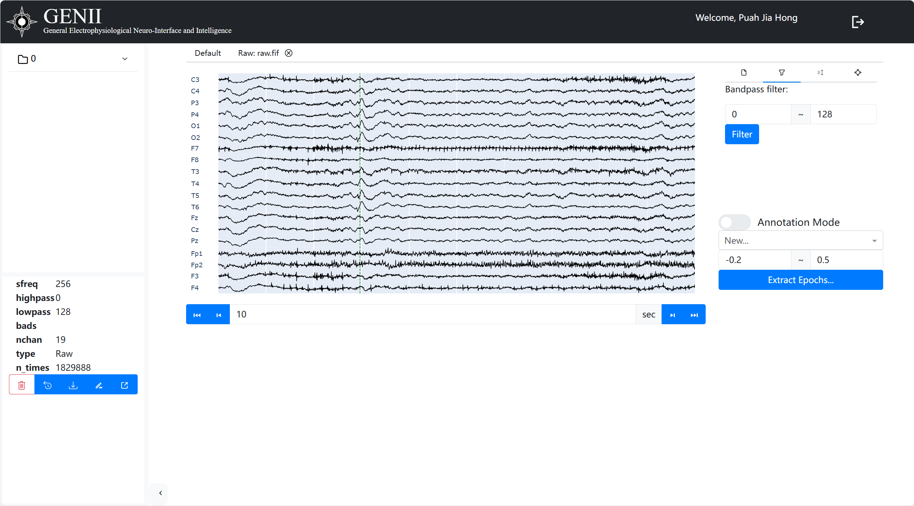
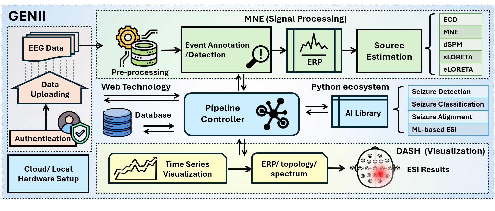

<div align="center">

# GENII
**A powerful neurophysiology data processing and visualization platform.**

<p align="center">
  <a href="https://github.com/jhpuah/EEGDM/blob/main/EEGDM_V2.pdf">
    
  </a>
  <a href="https://huggingface.co/jhpuah/eegdm/tree/main">
    
  </a>
</p>

<div align="center">
<br>

</div>
<br>

</div>

```Genii-Python``` enables you to process, analyze, and visualize neurophysiological data, offering user authentication, file upload, data processing, and interactive data visualization functionalities.

## Features
- It utilizes the mne-python library for data analysis and provides user authentication, file upload, data processing (such as filtering, reference electrode setup), and interactive data visualization functions.
- User Authentication
- File upload
- Data processing
- Interactive data visualization
- Data saving
- Modular design

# Quick Start

## Environment Preparation

```
conda create -n GENII pip python=3.10.12
conda activate GENII
git clone https://github.com/genii-open/genii-python.git
pip install -r requirements.txt
```

### Run

```
python app.py
```

By default, the program will run in debug mode and listen on port 8892. You can access it via a browser at http://127.0.0.1:8892.

# Workflow

The process of processing EEG data in the ```Genii-Python``` project can be divided into the following main stages:

### Authentication And Data Uploading

- Raw EEG data serves as the starting point of the entire process.
- After authentication, users upload EEG data, which may originate from the cloud or local hardware devices.
<br>
(You can contact us for account if you are interested in this software.)

### MNE (Signal Processing)

- **Preprocessing**: The uploaded EEG data will first undergo preprocessing to prepare for subsequent analysis.<br>
- **Event Annotation/Detection**: This step identifies specific events or patterns in the data according to its annotations.<br>
- **ERP (Event-Related Potentials)**: Event-Related Potentials (ERP) data contains peak alignment and so on.<br>
- **Source Estimation**: Finally, the system will perform source estimation to estimate the source of these electrophysiological activities in the brain. Source estimation supports multiple algorithms, including ```ECD```, ```MNE```, ```dSPM```, ```sLORETA```, and ```eLORETA```.

### Core Control and Python Ecosystem

- **Pipeline Controller**: This is a core component responsible for coordinating the entire data processing workflow, including interactions with web technologies, databases, MNE signal processing modules, and AI libraries within the Python ecosystem.<br>
- **Web Technology**: Used for user interfaces and front-end/back-end interactions, exchanging data with the Pipeline Controller and databases.<br>
- **Database**: Stores and manages data, communicating bidirectionally with web technologies and the Pipeline Controller.<br>
- **AI Library**: Within the Python ecosystem, the project integrates an AI library for performing more advanced analytical tasks, such as ```Epilepsy Detection```, ```Epilepsy Classification```, ```Epilepsy Alignment```, and ```Machine Learning-based ESI (Event-Related Synchronization Index)```.

### Data Visualization (DASH)

- **Time series visualization**: The processed data can be visualized in time series to show the changes of signals over time.<br>
- **ERP/topology/spectrum**: The system also supports the generation of ERP waveform, brain topology, and spectrum analysis graphs, providing multi-dimensional visualization.<br>
- **ESI results**: Finally, the results of ESI (Event-Related Synchronization Index) will also be visualized through DASH, helping users intuitively understand the analysis results.<br>

<div align="center">
<br>

</div>
<br>

# Notes

We use the freesurfer template brain (including boundary element model and coordinate transformation) during EEG Source Imaging, the use of custom brain model is currently not supported.

EEG signal preprocessing (like Independent Component Analysis) is not implemented.

## How to show high-quality previews?

Use ```--preview-method auto``` to enable previews.

The default installation includes a fast latent preview method that's low-resolution. To enable higher-quality previews with [TAESD](https://github.com/madebyollin/taesd), download the [taesd_decoder.pth, taesdxl_decoder.pth, taesd3_decoder.pth and taef1_decoder.pth](https://github.com/madebyollin/taesd/) and place them in the `models/vae_approx` folder. Once they're installed, restart ComfyUI and launch it with `--preview-method taesd` to enable high-quality previews.

## How to use TLS/SSL?
Generate a self-signed certificate (not appropriate for shared/production use) and key by running the command: `openssl req -x509 -newkey rsa:4096 -keyout key.pem -out cert.pem -sha256 -days 3650 -nodes -subj "/C=XX/ST=StateName/L=CityName/O=CompanyName/OU=CompanySectionName/CN=CommonNameOrHostname"`

Use `--tls-keyfile key.pem --tls-certfile cert.pem` to enable TLS/SSL, the app will now be accessible with `https://...` instead of `http://...`.

> Note: Windows users can use [alexisrolland/docker-openssl](https://github.com/alexisrolland/docker-openssl) or one of the [3rd party binary distributions](https://wiki.openssl.org/index.php/Binaries) to run the command example above.
<br/><br/>If you use a container, note that the volume mount `-v` can be a relative path so `... -v ".\:/openssl-certs" ...` would create the key & cert files in the current directory of your command prompt or powershell terminal.

## Support and dev channel

[Discord](https://comfy.org/discord): Try the #help or #feedback channels.

[Matrix space: #comfyui_space:matrix.org](https://app.element.io/#/room/%23comfyui_space%3Amatrix.org) (it's like discord but open source).

See also: [https://www.comfy.org/](https://www.comfy.org/)

## Frontend Development

As of August 15, 2024, we have transitioned to a new frontend, which is now hosted in a separate repository: [ComfyUI Frontend](https://github.com/Comfy-Org/ComfyUI_frontend). This repository now hosts the compiled JS (from TS/Vue) under the `web/` directory.

### Reporting Issues and Requesting Features

For any bugs, issues, or feature requests related to the frontend, please use the [ComfyUI Frontend repository](https://github.com/Comfy-Org/ComfyUI_frontend). This will help us manage and address frontend-specific concerns more efficiently.

### Using the Latest Frontend

The new frontend is now the default for ComfyUI. However, please note:

1. The frontend in the main ComfyUI repository is updated fortnightly.
2. Daily releases are available in the separate frontend repository.

To use the most up-to-date frontend version:

1. For the latest daily release, launch ComfyUI with this command line argument:

   ```
   --front-end-version Comfy-Org/ComfyUI_frontend@latest
   ```

2. For a specific version, replace `latest` with the desired version number:

   ```
   --front-end-version Comfy-Org/ComfyUI_frontend@1.2.2
   ```

This approach allows you to easily switch between the stable fortnightly release and the cutting-edge daily updates, or even specific versions for testing purposes.

### Accessing the Legacy Frontend

If you need to use the legacy frontend for any reason, you can access it using the following command line argument:

```
--front-end-version Comfy-Org/ComfyUI_legacy_frontend@latest
```

This will use a snapshot of the legacy frontend preserved in the [ComfyUI Legacy Frontend repository](https://github.com/Comfy-Org/ComfyUI_legacy_frontend).

# QA

### Which GPU should I buy for this?

[See this page for some recommendations](https://github.com/comfyanonymous/ComfyUI/wiki/Which-GPU-should-I-buy-for-ComfyUI)
